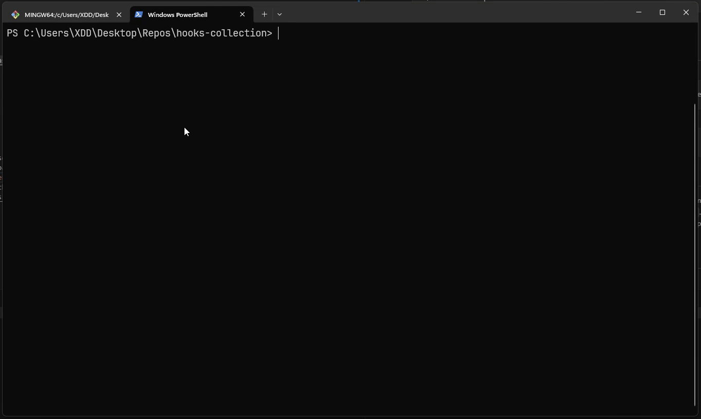

<div align="center">
  <h1>hooks-collection 🪝</h1>
  <p>
    <small>Collection of Git Hooks I usually use ¯\_(ツ)_/¯</small>
  </p>
</div>

# 📥 Usage
## Manual
1. Copy the desired hook to the `.git/hooks` directory of your repository.
  Example directory structure if done right:
    ```
    .
    ├── .git (hidden by default)/
    │   └── hooks/
    │       └── pre-commit
    ├── .github
    ├── .editorconfig
    ├── .gitignore
    └── ... (other files)
    ```
## Semi-Manual (Via install script)
1. Download [install-hooks.ps1](./install-hooks.ps1) and place it in the root of your repository.
2. Double click and execute the script in a PowerShell or use PS Terminal.
    ```powershell
    .\install-hooks.ps1
    ```
3. Follow the instructions in the script.

## Automatic (Via install script)
1. Run the following command in your PS Terminal.
    ```powershell
      irm https://raw.githubusercontent.com/Kiruyuto/hooks-collection/master/install-hooks.ps1 | iex
    ```
    ... or use shorter version:
    ```powershell
      irm https://www.kiru.dev/api/install-hooks | iex
    ```


## 📜 Short description of each hook
- [pre-commit](./pre-commit): Runs dotnet format on staged .CS files. Uses `info` severity for maximum formatting.
- [commit-msg](./commit-msg): Checks if the commit message follows the pattern: `type(scope): message`. Where `type` is one of the following: `feat`, `fix`, `ci`, `chore`, `docs`, `test`, `style`, `refactor`, `revert`, `build`, `release`, `security`. `scope` is optional and `message` is a short description of the commit. Does not check for the length of the commit message.  
  TL;DR: Enforces [Conventional Commits](https://www.conventionalcommits.org/en) format.

# 📽️ Example
